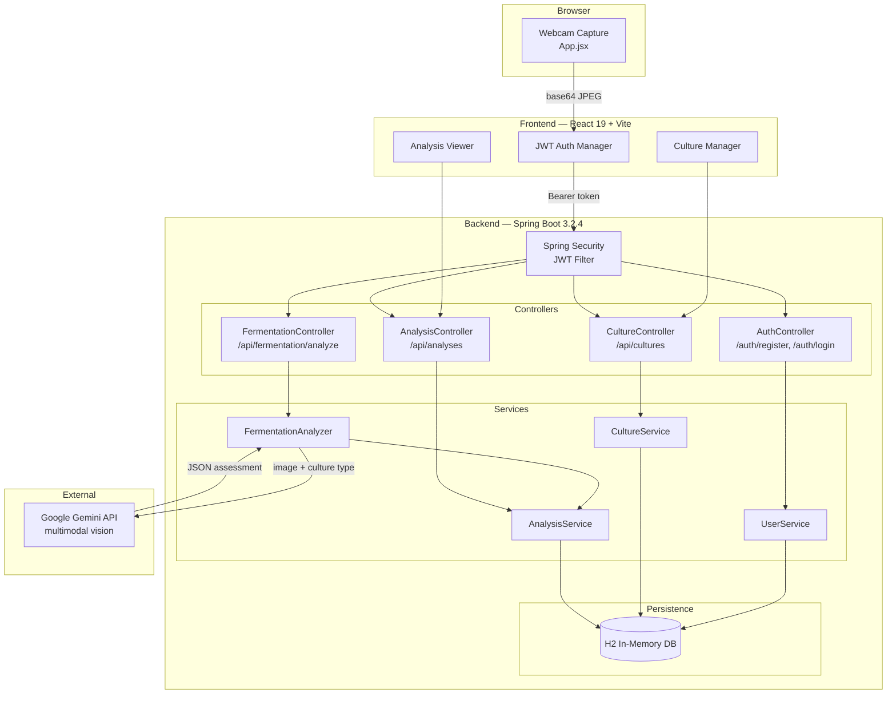

# Bio-State Monitor — Architecture

A full-stack fermentation health monitor. Users point a webcam at a sourdough or kombucha culture; the app captures a frame, sends it through a secured backend, and returns an AI-generated assessment.

---

## System Diagram



---

## Request Flow

1. **Capture** — React grabs a webcam frame and encodes it as base64 JPEG
2. **Auth** — JWT attached to `Authorization: Bearer` header; Spring Security validates on every protected route
3. **Analyze** — `POST /api/fermentation/analyze` carries `{ base64Image, cultureType, cultureId }`
4. **AI call** — `FermentationAnalyzer` forwards image + culture type to Gemini with fermentation heuristics baked into the prompt
5. **Response** — Gemini returns structured JSON; backend persists it and returns to client

**Gemini response shape:**
```json
{
  "status": "healthy | at-risk | complete",
  "confidence": 0.0–1.0,
  "visual_observations": "...",
  "rag_reference": "...",
  "actionable_advice": "..."
}
```

---

## Data Models

| Model    | Key Fields                                                        |
|----------|-------------------------------------------------------------------|
| User     | id, username, email, password (hashed), timestamps               |
| Culture  | id, name, type (sourdough / kombucha), user_id, created_at       |
| Analysis | id, culture_id, status, confidence, observations, advice, timestamp |

---

## Tech Stack

| Layer    | Technology                                      |
|----------|-------------------------------------------------|
| Frontend | React 19, Vite, Tailwind CSS, lucide-react      |
| Backend  | Java 17, Spring Boot 3.2.4, Spring Security, JPA |
| Database | H2 in-memory                                    |
| AI       | Google Gemini (multimodal)                      |
| Auth     | JWT (io.jsonwebtoken)                           |
| Testing  | JUnit 5, Mockito (Backend); Jest, React Testing Library (Frontend) |

---

## Environment Variables

| Variable        | Required | Description                        |
|-----------------|----------|------------------------------------|
| `GEMINI_API_KEY` | Yes      | Authenticates backend with Gemini  |
| `BACKEND_PORT`  | No       | Defaults to `8080`                 |
| `FRONTEND_PORT` | No       | Defaults to `5173`                 |

---

## Known Limitations & Future Work

- **H2 is ephemeral** — all data resets on restart. Replace with PostgreSQL for production.
- **Synchronous AI calls** — Gemini requests block the HTTP thread. Consider `@Async` or a job queue under load.
- **No image storage** — base64 frames are analyzed but not durably stored; historical visual comparison isn't possible today.
- **Single user scope** — no multi-tenancy or role-based access beyond basic auth.