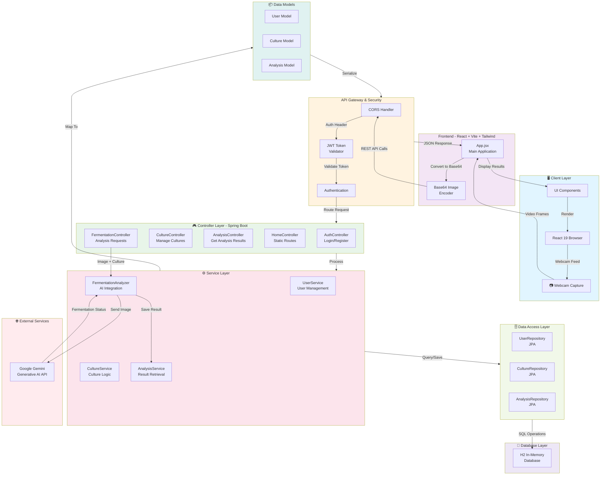

# Bio-State Monitor Architecture

## System Overview

The Bio-State Fermentation Monitor is a full-stack web application that combines real-time webcam capture with AI-powered fermentation analysis. It consists of a React frontend for user interaction and a Spring Boot backend for processing and data persistence.

## Architecture Diagram

## Component Details

### Frontend Layer

**Technology Stack:** React 19, Vite, Tailwind CSS, Lucide Icons

- **App.jsx**: Main application component that handles:
  - Webcam live feed capture
  - Image encoding to Base64 format
  - REST API communication
  - Results display and user interface

**Key Features:**
- Real-time webcam integration
- Base64 image encoding for API transmission
- JWT token management for authentication
- Responsive UI with Tailwind CSS

### API Gateway & Security

**Authentication:** Spring Security + JWT (JSON Web Tokens)

- CORS handling for frontend communication
- JWT token validation on all protected endpoints
- Automatic token refresh mechanism

### Backend Controller Layer (Spring Boot)

Five specialized controllers manage different aspects of the application:

1. **AuthController**: User authentication
   - User login and registration
   - JWT token generation

2. **HomeController**: Static content routes
   - Serves frontend assets
   - Health check endpoints

3. **CultureController**: Culture management
   - CRUD operations for fermentation cultures
   - Culture type management (sourdough, kombucha, etc.)

4. **FermentationController**: Analysis requests
   - Receives webcam image frames
   - Triggers AI analysis via FermentationAnalyzer
   - Returns analysis results

5. **AnalysisController**: Historical data retrieval
   - Fetches previous analysis results
   - Provides analysis history for users

### Service Layer

**Business Logic Implementation:**

1. **UserService**: User account management
   - User registration and profile management
   - Password handling

2. **CultureService**: Culture management logic
   - Culture creation and updates
   - Culture type validation

3. **AnalysisService**: Result management
   - Stores analysis results
   - Retrieves historical analyses

4. **FermentationAnalyzer**: AI Integration
   - Interfaces with Google Gemini API
   - Processes fermentation analysis requests
   - Formats responses with:
     - Status (healthy, at-risk, complete, etc.)
     - Confidence levels
     - Visual observations
     - RAG references
     - Actionable advice

### Data Access Layer (JPA Repositories)

- **UserRepository**: User entity persistence
- **CultureRepository**: Culture entity persistence
- **AnalysisRepository**: Analysis result persistence

All repositories use Spring Data JPA for ORM functionality.

### Data Models

**User Model:**
- User ID
- Username
- Email
- Password (hashed)
- Created/Updated timestamps

**Culture Model:**
- Culture ID
- Culture name
- Culture type (sourdough, kombucha, etc.)
- User reference
- Creation date

**Analysis Model:**
- Analysis ID
- Culture reference
- Image data reference
- Status
- Confidence score
- Visual observations
- RAG references
- Actionable advice
- Timestamp

### Database

**Technology:** H2 In-Memory Database

- Lightweight, embedded database
- No external database setup required
- Perfect for development and testing
- Data persists for the application lifecycle

### External Services

**Google Gemini Generative AI API**

- Receives culture image and type
- Analyzes fermentation visual indicators
- Returns structured JSON response with:
  - Fermentation status
  - Confidence level
  - Visual observations
  - Recommendations

## Data Flow

1. **Image Capture**: User captures webcam frame via React frontend
2. **Encoding**: Image converted to Base64 format
3. **API Request**: Frontend sends image + culture type to backend via REST API
4. **Authentication**: JWT token validated by security filters
5. **Controller Processing**: FermentationController receives request
6. **AI Analysis**: FermentationAnalyzer sends image to Google Gemini API
7. **Response Processing**: AI response parsed and formatted
8. **Data Persistence**: Results stored in H2 database via repository layer
9. **Response**: Analysis results returned to frontend as JSON
10. **UI Display**: React frontend displays results to user

## Technology Stack

### Frontend
- React 19
- Vite (build tool)
- Tailwind CSS (styling)
- Lucide Icons (UI icons)

### Backend
- Java 17
- Spring Boot 3.2.4
- Spring Security
- Spring Data JPA
- H2 Database
- JWT (io.jsonwebtoken)

### External
- Google Gemini API (AI analysis)

## Environment Configuration

Required environment variables:
- `GEMINI_API_KEY`: Google Gemini API key for fermentation analysis

See `backend/src/main/resources/application.properties` for additional configuration.

## Scalability Considerations

**Current Design (Development):**
- H2 in-memory database suitable for single-user or small team testing
- JWT-based stateless authentication allows horizontal scaling
- Stateless service layer enables microservice migration

**Future Production Considerations:**
- Replace H2 with persistent PostgreSQL or MySQL
- Add caching layer (Redis) for frequently accessed analyses
- Implement API rate limiting
- Add monitoring and logging (ELK stack)
- Consider containerization (Docker/Kubernetes)
